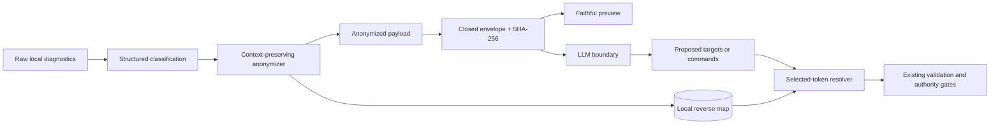

# Architecture and adoption boundary

## Data flow



Only the envelope crosses the LLM boundary. The reverse map is local state and
does not share a serialization path with the envelope.

## State model

```text
mapping context created
  -> originals observed and aliases allocated
  -> one or more payloads emitted with the same scoped identities
  -> selected aliases optionally resolved locally
  -> mapping context expired and destroyed
```

Equal token text in two mapping contexts is not evidence of equal identity.
The `mappingId` prevents a caller from accidentally combining an envelope with
the wrong local map.

## FixOS adoption profile

FixOS can adopt the standard without changing its HITL authority model:

1. replace the foreign-home fallback that emits `/home/[USER]/...` with a
   segment-aware callback that retains the suffix;
2. retain one mapping context for the complete HITL session so repeated IPs,
   UUIDs and paths remain recognizable across turns;
3. render the preview from the anonymized payload without stripping brackets
   from `[USER]` or `[HOSTNAME]`;
4. keep the reverse map out of diagnostics and prompts;
5. resolve only aliases referenced by the exact selected remediation, after
   the existing plan/confirmation boundary.

The migration must keep FixOS's current last-boundary tests: no real hostname,
username or home path may reach any LLM call, including autonomous command
output and orchestrator evaluation.

## LLX adoption profile

LLX already models an anonymization result with a local mapping. Adoption can
retain that internal abstraction while changing visible tokens to the standard
semantic vocabulary and adding an explicit mapping-context identifier.

The mapping must not be serialized into an LLM request or reusable remote
result. Hash-shaped token suffixes are not required and should not replace the
first-observation numbering contract.

## Security invariants

- Formatting never receives raw input after the anonymized payload exists.
- The transport serializer has no field for reverse-map values.
- Semantic IP tokens are intentionally non-reversible.
- Resolution rejects aliases absent from the exact local context.
- Resolution of a valid token is data substitution, not authorization.
- Expiry destroys mappings even if prompts or responses remain cached.
